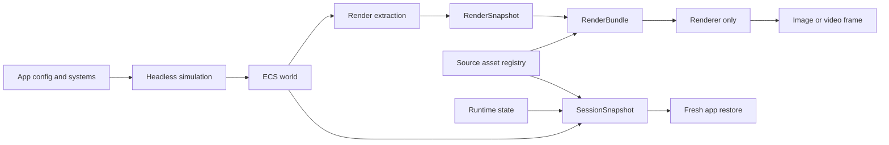

# Headless Validation, Render Bundles, And App Snapshots Roadmap

Date: 2026-06-28
Status: proposal
Primary context: PR #36 headless prototype review and ultracode subsystem audit

## Executive Summary

The vision is feasible, and it is aligned with Aperture's core architecture: ECS state is
authoritative, rendering is a derived view, and the extraction boundary can become a
portable artifact boundary.

The right target is not "replace the browser" in one step. The right target is:

1. Make headless Node the default inner loop for ECS logic, deterministic system
   iteration, asset closure validation, and render bundle production.
2. Make render bundles self-contained enough that a renderer can consume only the
   bundle and produce an image.
3. Make session snapshots explicit restore artifacts for simulation and app state.
4. Keep browser runs as the outer verifier for DOM integration, real browser input
   devices, WebGPU adapter/device behavior, audio, UI, and final pixel confidence.

If these artifacts are well-specified, browser usage moves from "the only way to try
anything" to "the final environment and compatibility gate". That is a superior
iteration model, but it requires tightening several contracts introduced by PR #36.

## Current Assessment

PR #36 is directionally important but not merge-ready as the foundation for this
workflow.

Confirmed useful pieces:

- One-shot `aperture headless` execution.
- A warm `headless serve` process that can step, inspect ECS, and write bundles.
- A render command that can render a saved snapshot bundle in Chromium.
- A recursive JSON codec for typed arrays.
- Seeded random/time plumbing.
- A first asset-provenance shape.
- Tests around the new commands and bundle flow.

Confirmed blockers:

- `pnpm run format:check` fails on the PR branch.
- Root `engines.node` allows Node 20, but native TypeScript config loading in the PR
  requires Node 22 behavior in practice.
- `aperture render --width/--height` are ignored by the current render harness.
- A failed Chromium launch can leave the static server alive.
- Direct input injection bypasses browser-equivalent input edge semantics.
- One-shot and warm-serve stepping disagree on frame/time semantics.
- The Node asset loader is placeholder-only, so real asset fidelity is not proven.
- Shader placeholder loading can leave assets stuck in `loading` while handles appear
  ready.
- The bundle format does not prove asset closure completeness.
- Per-entry asset provenance exists in the registry but is not serialized into the
  mirrored source-asset registry.
- CLI diagnostics are not fully covered by the diagnostics catalog check.
- E2E and publish checks do not prove that an installed package contains and can run
  the render harness.
- Existing package-boundary checks do not cover the new CLI/app headless surface.

The recommendation is to either repair PR #36 before merge or mine it into smaller
PRs. Do not treat the current PR as the final contract.

## Target Model



The render bundle and the session snapshot are different products:

- A `RenderBundle` is a renderer-only artifact. It contains a `RenderSnapshot` plus
  the complete asset closure needed to produce pixels for that frame. It should not
  require app code, simulation systems, DOM state, network access, or asset files.
- A `SessionSnapshot` is a simulation/app restore artifact. It contains ECS state,
  resource values, signal values, deterministic runtime state, selected system state,
  and enough bootstrap metadata to create a fresh app and continue. It may optionally
  include a render bundle as an inspection sidecar.

This distinction avoids a trap: render bundles can be strict and self-contained,
while session snapshots can remain honest about needing app modules and registered
systems to resume execution.

## Terms And Contracts

| Term              | Contract                                                                                                                                                      | Must Not Contain                                                                                            |
| ----------------- | ------------------------------------------------------------------------------------------------------------------------------------------------------------- | ----------------------------------------------------------------------------------------------------------- |
| `RenderSnapshot`  | Per-frame extracted render data with handles into render/source assets. Structured-clone friendly.                                                            | Source files, network URLs as required runtime dependencies, GPU objects, simulation authority.             |
| `RenderBundle`    | Self-contained renderer input for one frame or a frame sequence. Snapshot plus complete source-asset closure and render-target requirements.                  | App systems, gameplay state, DOM state, arbitrary JS instances, hidden scene graph state.                   |
| `SessionSnapshot` | Restore input for a fresh app/session. ECS scene, resources, signals, deterministic runtime state, system-state payloads, asset registry, bootstrap metadata. | GPU resources, live callbacks, closures, promises, browser object handles, physics backend internals in v1. |
| `InputReplay`     | Canonical stream of generated input events at the same boundary the browser worker consumes.                                                                  | Direct mutation of `InputState` internals.                                                                  |
| `AssetClosure`    | Complete list of asset handles referenced by the snapshot and their transitive dependencies.                                                                  | Placeholders in strict mode, unresolved network/file dependencies.                                          |

## Load-Bearing Principles

1. ECS remains the source of truth.
2. Rendering remains a derived view of ECS extraction.
3. Render extraction stays explicit and serializable.
4. Worker-by-default browser architecture remains valid.
5. Headless and browser input must share generated input event semantics.
6. Strict render bundles perform no network fetches and do not read app asset files.
7. Placeholder assets are an explicit mode, never an accidental success condition.
8. Restore always creates a fresh app/session. Do not mutate a live renderer into
   acting like restored simulation authority.
9. Every serialized artifact carries schema versions and compatibility metadata.
10. Browser validation remains necessary for browser host integration and device
    behavior, even after headless validation is robust.

## Roadmap Overview

| Phase                        | Outcome                                                              | Primary Proof                                                                    |
| ---------------------------- | -------------------------------------------------------------------- | -------------------------------------------------------------------------------- |
| 0. Stabilize PR #36          | Existing prototype is safe to merge or split.                        | Full `pnpm run check`, Node version decision, no known CLI hangs.                |
| 1. Render bundle contract    | Bundles are versioned, strict, and closure-checked.                  | Bundle preflight fails on missing/unready/placeholder/transitive assets.         |
| 2. Real Node asset pipeline  | Headless can load real app assets without a browser.                 | Textured GLB fixture bundles with zero placeholders and renders correct pixels.  |
| 3. Input and time parity     | One-shot, serve, and browser-worker stepping use the same semantics. | Same input replay produces same ECS digest and same input edges.                 |
| 4. Portable renderer command | `aperture render` is reliable as a standalone image producer.        | Installed package smoke test renders nonblank image at requested dimensions.     |
| 5. Deterministic runtime     | Repeatable headless runs are enforceable, not only best effort.      | Snapshot/replay hash tests and strict diagnostics for nondeterministic APIs.     |
| 6. Session snapshots         | Full app state can be exported and restored within defined limits.   | Save, restore fresh app, continue simulation, compare ECS/render outputs.        |
| 7. CI, docs, release gates   | The workflow is protected against regression.                        | Dedicated checks for headless purity, bundles, diagnostics, pack contents, docs. |

## Phase 0: Stabilize Or Split PR #36

Goal: keep the valuable prototype work, but avoid merging ambiguous contracts.

Required fixes:

- Run formatting and make `pnpm run format:check` pass.
- Decide the Node version contract:
  - Option A: raise package/root engine to Node 22+ for native TypeScript config
    loading.
  - Option B: keep Node 20 support and add an explicit TypeScript loader fallback.
- Fix `aperture render --width` and `--height` so the requested render target is
  honored in the browser harness.
- Ensure static servers are closed if browser launch fails before normal `try/finally`
  cleanup begins.
- Align one-shot and warm-serve step semantics.
- Fix placeholder shader/status handling so ready handles cannot mask assets stuck in
  `loading`.
- Add a packed-install smoke test for the CLI and render harness.
- Add diagnostics-catalog coverage for CLI `ApertureCliError` codes and warnings.
- Preserve source-asset registry provenance through serialization and mirror restore.
- Add a headless package-boundary/purity check for `packages/cli` and `packages/app`
  headless paths.

Decision criteria:

- If these fixes stay small, merge PR #36 after repair.
- If they spread across assets, input, renderer, and diagnostics at once, split into
  the phases below and merge the smallest safe vertical slices.

## Phase 1: Render Bundle V1 Contract

Goal: define a bundle that the renderer can trust without app context.

### Proposed Envelope

```ts
interface ApertureRenderBundleV1 {
  format: "aperture.render-bundle";
  version: 1;
  engine: {
    apertureVersion: string;
    snapshotSchema: string;
    assetSchema: string;
    createdBy: "aperture headless" | "aperture serve" | string;
  };
  frame: number;
  time?: number;
  renderTarget: {
    width: number;
    height: number;
    colorSpace: "srgb" | "display-p3";
    sampleCount: number;
    toneMapping?: string;
    exposure?: number;
  };
  requirements: {
    webgpuFeatures: string[];
    textureFormats: string[];
    limits?: Record<string, number>;
  };
  snapshot: {
    codec: "json-typed-array-v1";
    value: unknown;
  };
  assets: {
    completeness: "complete";
    allowPlaceholders: boolean;
    entries: SerializedSourceAssetEntryV1[];
  };
  closure: {
    referenced: string[];
    missing: string[];
    unready: string[];
    placeholders: string[];
  };
  diagnostics: SerializedDiagnostic[];
}
```

### Work Items

- Add explicit snapshot and asset schema versions.
- Harden typed-array decode:
  - Validate typed-array tags.
  - Validate lengths and offsets.
  - Reject unknown required encodings.
  - Reject impossible or truncated data.
- Add a closure collector that walks the `RenderSnapshot` and records every referenced
  mesh, material, texture, sampler, shader, sprite atlas, UI font, particle texture,
  light cookie, skybox, and environment asset.
- Add transitive dependency expansion:
  - Materials to textures and samplers.
  - Particle effects to textures and samplers.
  - UI/font/sprite assets to atlases.
  - Shaders/material programs to WGSL sources where applicable.
  - Environment/skybox assets to texture payloads.
- Add strict preflight:
  - Missing asset: fail.
  - Unready asset: fail.
  - Placeholder asset in strict mode: fail.
  - Unknown required asset kind: fail.
  - Mesh patch dependency without base payload: fail.
  - Network/file path needed at render time: fail.
- Preserve per-entry provenance in `serializeSourceAssetRegistry` and
  `mirrorSourceAssetRegistryFromMessage`.
- Make placeholder and hybrid modes explicit in bundle metadata and CLI output.
- Add a deterministic bundle digest for caching and comparison.

### Tests

- Unit tests for valid and invalid typed-array JSON payloads.
- Unit tests for closure collection across mesh, material, texture, sampler, shader,
  sprite, UI, particle, light, and environment references.
- Bundle write tests that fail when the snapshot references an asset absent from the
  source registry.
- Bundle write tests that fail in strict mode when a placeholder is present.
- Round-trip tests proving provenance survives serialization and mirror restore.
- Render tests for at least:
  - Procedural mesh with material.
  - Textured material.
  - Sprite or UI atlas.
  - Particle texture.
  - WGSL shader asset.
  - Environment or skybox asset once those are wired.

## Phase 2: Real Node Asset Pipeline

Goal: make Node capable of loading the same authored assets the browser loads, without
requiring a browser during simulation.

### Node Loader Shape

```ts
interface NodeApertureAssetLoaderOptions {
  root: string;
  publicDir?: string;
  assetBaseDir?: string;
  mode: "strict" | "hybrid" | "placeholder";
  imageDecoder: NodeImageDecoder;
  decoderAssetsDir?: string;
  allowHttp?: boolean;
}
```

Modes:

- `strict`: load real assets only. Missing files, unsupported decode paths, missing
  WASM decoders, and unresolved references are hard failures.
- `hybrid`: load real assets where supported and record explicit placeholders with
  diagnostics where unsupported.
- `placeholder`: preserve the fast structural flow from PR #36 for early development
  and tests that do not need pixels.

### URL And Fetch Semantics

Implement a Node resolver with explicit browser-equivalent rules:

- `/assets/foo.png` resolves against the configured public root.
- Relative config asset paths resolve against the config/app root.
- Relative GLTF external paths resolve against the containing GLTF file.
- `file:` URLs read through `fs`.
- `data:` URLs decode directly.
- `http:` and `https:` are disabled by default in strict reproducible runs unless
  explicitly allowed.

Add a fetch-like adapter for existing GLTF, GLB, decoder, shader, and audio loaders.
Do not rely on Node `fetch` for `file:` URLs.

### Image And Decoder Support

Required first:

- PNG and JPEG to RGBA.
- Width, height, format, byte length, and provenance metadata.
- Data URI images.
- GLTF embedded and external images.

Then add:

- Draco decoder asset resolution.
- Meshopt decoder asset resolution.
- Basis/KTX2 decoder asset resolution.
- KTX2 fallback policy when actual target GPU features are unknown.
- RGBE `.hdr` environment loading through `asset.hdr()`, with an embedded
  equirect payload in the source-asset registry and render-harness preparation
  before `renderSnapshot()`. Broader environment formats and prefiltered cube-map
  payloads can build on the same contract.

Dependency decision:

- `sharp` gives broad coverage but adds a native/heavy dependency.
- Smaller JS decoders reduce install cost but may leave gaps.
- The first implementation should document the tradeoff and keep decoder selection
  behind an injected `NodeImageDecoder` interface so the dependency can change.

### Reuse Existing Runtime Logic

Avoid duplicating browser asset orchestration in CLI code.

- Refactor the current app asset-loading orchestration into reusable helpers.
- Reuse `loadSystemGltfAsset`-style source-asset registration.
- Reuse `createNoFetchGlbSourceLoaderReport()` for byte-backed GLB paths.
- Keep source asset registry writes in the app/runtime layer, not hidden inside CLI
  command glue.
- Pass the loaded config root from PR #36's config loader into the Node asset loader.

### Tests

- URL resolver tests for root-relative, config-relative, GLTF-relative, `file:`,
  `data:`, missing file, and disabled network cases.
- Standalone PNG/JPEG texture tests with sampled pixel assertions.
- GLB fixture test with mesh, material, texture, and sampler source assets.
- GLTF fixture test with external `.bin` and external image files.
- Data URI GLTF fixture test.
- Strict-mode failure tests for missing image, missing decoder, unsupported format,
  and unresolved external reference.
- Hybrid-mode tests proving placeholders are recorded with exact asset ids and
  diagnostics.
- Render-bundle tests proving real texture bytes and mesh buffers survive bundle
  serialization.

## Phase 3: Input, Frame, And Time Parity

Goal: make headless input and stepping equivalent to the browser worker boundary.

### Canonical Input Boundary

The canonical replay format should be generated input events, not direct state
mutation:

```ts
interface HeadlessInputReplayEvent {
  frame?: number;
  sequence?: number;
  event: ApertureGeneratedInputEvent;
}
```

Each headless step should:

1. Select the current frame id.
2. Drain queued generated input events for that frame.
3. Call the same input frame advancement function used by the browser path exactly
   once.
4. Step systems with deterministic `delta` and `time`.
5. Extract the render snapshot for the same frame.
6. Increment the next frame id.

Do not mutate `InputState` internals directly from CLI injection code. Legacy
`--inject` JSON can remain as a compatibility layer, but it should translate into
generated events and go through the queue.

### Time Policy

Choose and document one fixed-step default. Recommended default:

- Frame 0 steps at elapsed time `0`.
- Frame N steps at elapsed time `N * delta`.
- Warm serve, one-shot headless, and browser-worker manual stepping use the same
  policy when deterministic mode is enabled.

If live browser mode uses `performance.now()`, that is a different clock mode and
should be labeled as such. Deterministic parity tests should use the manual/fixed
clock.

### Serve API

`headless serve` should expose the same input capabilities as browser devtools:

- Action set/release.
- Pointer move/down/up.
- Wheel.
- Keyboard.
- Gamepad state.
- Virtual action sources.
- Reset/clear.
- Batched replay submission.

Serve responses should include frame id, time, ECS digest where requested, input
digest where requested, diagnostics, and optional bundle path.

### Recorder

If an input recorder is added, record at the worker drain boundary, not at raw DOM
dispatch. This records the actual normalized event stream the simulation consumes.

### Tests

- One-shot and serve produce identical ECS digests for the same event replay.
- Browser-worker deterministic manual step and headless produce identical input edge
  state for:
  - Action pressed/down/up.
  - Same-frame pointer down/up click.
  - Wheel delta reset.
  - Pointer position and button state.
  - Keyboard mapping.
  - Gamepad mapping.
  - Virtual action mapping.
  - Input reset.
- Empty frames clear transient input edges exactly once.
- Bundle frame id and extracted frame id match after one step in both one-shot and
  serve modes.

## Phase 4: Portable Renderer Command

Goal: make `aperture render` a trustworthy image-producing command for bundles.

Required behavior:

- Render from a bundle without app code.
- Honor render target width, height, color space, sample count, and output format.
- Preflight bundle closure before launching the browser.
- Fail fast with actionable diagnostics on schema mismatch or unsupported required
  features.
- Close static servers and browser resources on every failure path.
- Avoid relying on source tree paths when executed from an installed package.
- Record renderer metadata in output diagnostics:
  - Browser channel.
  - WebGPU adapter info where available.
  - Requested dimensions.
  - Actual output dimensions.
  - Bundle digest.

Current implementation: `aperture render --json` emits a machine-readable report
with renderer diagnostics containing the browser launch metadata, WebGPU metadata
reported by the harness, requested dimensions, actual PNG dimensions, and bundle
digest. The render-bundle E2E asserts these fields on a real Chromium/WebGPU run.

Tests:

- Render output dimensions match requested dimensions.
- Invalid browser channel exits without hanging.
- Missing bundle asset fails before screenshot capture.
- Packed-install CLI can render a fixture bundle.
- E2E nonblank image test plus a pixel-color assertion for a known fixture.
- Render harness files are included in package tarballs.

## Phase 5: Deterministic Runtime

Goal: make deterministic iteration enforceable.

Work items:

- Keep `context.random` and `context.time` as the blessed APIs.
- Add RNG state export/import, not only seed configuration.
- Add fixed-step clock state export/import.
- Add optional strict diagnostics for systems that call nondeterministic globals:
  - `Math.random`.
  - `Date.now`.
  - `new Date()` for runtime decisions.
  - `performance.now()` outside approved clock code.
- Add deterministic ECS and render-snapshot digest helpers.
- Add repeatability tests:
  - Same seed, same input replay, same app state -> same digest.
  - Different seed -> expected different digest where random is used.
  - Save session, restore, continue -> same digest as uninterrupted run.

This phase should start as a diagnostics mode, not a universal runtime ban. Some apps
will need escape hatches, but those escape hatches should be visible in validation
reports.

## Phase 6: SessionSnapshot V1

Goal: export enough app state to stop, move, restore, and continue simulation in a
fresh runtime.

### Proposed Envelope

```ts
interface ApertureSessionSnapshotV1 {
  format: "aperture.session-snapshot";
  version: 1;
  bootstrap: {
    apertureVersion: string;
    appConfigId: string;
    appMode: "headless";
    packageVersions: Record<string, string>;
    systemModules: SystemModuleManifestEntry[];
    worldOptions: unknown;
    fixedStepOptions?: unknown;
    physics?: PhysicsBootstrapConfig;
    startOptions?: unknown;
    assetLoader: AssetLoaderManifest;
    limitations: string[];
  };
  simulation: {
    scene: ApertureSceneDocument;
    componentRegistry: ComponentRegistryManifest;
    resources: SerializedResourceEntry[];
    signals: SerializedSignalEntry[];
    sourceAssets: SerializedSourceAssetRegistryV1;
    diagnostics: SerializedDiagnostic[];
  };
  runtime: {
    frame: number;
    nextFrame: number;
    time: FrameTimeState;
    fixedStepClock: FixedStepClockState | null;
    randomStreams: SerializedRandomStreamState[];
    random?: RandomStreamState | null;
    systems: SerializedSystemStateEntry[];
  };
  physics: {
    mode: "rebuild-from-ecs-authoring";
    diagnostics?: SerializedDiagnostic[];
  };
  inspection?: {
    renderBundle?: ApertureRenderBundleV1;
  };
}
```

### What Can Be Serialized Now

- ECS scene state through `saveScene` and `loadScene`.
- Component payloads with registered component serializers.
- Parent/child relationships through scene document reconstruction.
- Source assets once provenance and real Node loading are fixed.
- Bootstrap metadata for the app config digest, package version, system module
  hooks, world/start/fixed-step/physics options, and asset loader kind.
- Component registry ids for the saved scene.
- Resource entries and signal entries as JSON-safe descriptor data.
- Runtime frame aliasing (`frame` plus legacy `nextFrame`) and built-in RNG
  stream state.
- Render snapshots as optional inspection artifacts.

### What Needs New APIs

- Resource descriptors with serialize/restore hooks.
- Signal descriptors with serialize/restore hooks.
- System state hooks:

```ts
interface SerializableSystemState<TState> {
  snapshotState(ctx: SystemSnapshotContext): TState | undefined;
  restoreState(
    payload: TState,
    ctx: SystemRestoreContext,
    remapEntityRef: (oldEntity: Entity) => Entity | undefined,
  ): void;
  afterRestore?(ctx: SystemRestoreContext): void;
}
```

System-state payloads must be JSON-safe, versioned, and free of functions, promises,
GPU objects, DOM handles, and backend-native physics handles.

### Physics Policy

V1 should use:

```ts
{
  mode: "rebuild-from-ecs-authoring";
}
```

That means restore reconstructs physics from ECS-authored collider, rigid-body,
transform, and velocity state. It will not promise bit-for-bit warm restoration of a
backend-native physics world in v1.

Later versions can add backend-neutral warm state if the physics abstraction grows the
right hooks.

### Restore Algorithm

1. Resolve bootstrap manifest and create a fresh app/runtime.
2. Register component, resource, signal, asset, and system descriptors.
3. Rehydrate source assets before extraction/render use.
4. Load ECS scene into a fresh world.
5. Apply resources and signals.
6. Restore runtime frame/time, fixed-step clock, and RNG streams.
7. Restore serializable system state.
8. Rebuild physics from ECS-authoring state.
9. Run `afterRestore` hooks.
10. Optionally extract a render snapshot and compare to the inspection bundle.

Tests:

- Save and restore a simple ECS scene with transforms and hierarchy.
- Save and restore resources and signals with registered serializers.
- Save and restore a deterministic system with private state.
- Save and restore RNG state mid-sequence.
- Save and restore fixed-step accumulator state.
- Restore physics from ECS-authoring state and continue deterministically within v1
  tolerance.
- Save -> restore -> extract render bundle -> render known pixels.

Current implementation: SessionSnapshot v1 is exposed from
`@aperture-engine/app/headless`, restores into a fresh headless runner, captures
bootstrap metadata, scene/component registry/resources/signals/source
assets/frame-time/fixed-step clock/RNG stream state/system hook payloads, and
records the v1 physics policy as `rebuild-from-ecs-authoring`. Tooling can
attach a CLI-created render bundle at `inspection.renderBundle`; the sidecar is
encoded as JSON data so `@aperture-engine/app` does not depend on the CLI-owned
RenderBundle schema. The session tests prove fixed-step accumulator restoration
before continuation and assert the richer v1 envelope. The render-bundle E2E now
saves a session, restores a fresh runner, extracts a render bundle, renders it
with `aperture render`, and asserts known nonblack pixels.

## Phase 7: CI, Docs, And Release Gates

Goal: make the new workflow hard to regress.

Add checks:

- `check:headless-boundaries`: prevents CLI/app headless code from importing browser
  DOM-only paths except through explicit adapters.
- `check:render-bundle-fixtures`: validates strict bundle closure for fixture apps.
- `check:cli-diagnostics`: scans CLI error/warning codes into the diagnostics catalog.
- `check:pack-cli`: packs the CLI and runs installed smoke tests.
- `test:e2e:render-bundle`: renders fixture bundles and checks dimensions plus pixels.
- `test:session-snapshot`: save/restore parity tests.

Update docs:

- `docs/architecture/render-snapshots.md`: RenderSnapshot vs RenderBundle.
- `docs/architecture/headless-validation.md`: headless inner loop and browser outer
  loop.
- `docs/architecture/session-snapshots.md`: SessionSnapshot contract and limitations.
- `docs/authoring/assets.md`: strict/hybrid/placeholder Node asset modes.
- `docs/authoring/input-replay.md`: generated input replay format.
- `docs/DECISIONS.md`: update only if any architectural invariant changes. The
  proposed direction should not require changing the existing invariants.

Changesets:

- Add changesets for public CLI commands, app APIs, render bundle schema, and session
  snapshot APIs as they ship.

## Proof Matrix

| Area                 | Required Fixture Or Test | Passing Condition                                                             |
| -------------------- | ------------------------ | ----------------------------------------------------------------------------- |
| CLI package          | Packed-install smoke     | Installed `aperture headless` and `aperture render` work outside source tree. |
| Render bundle schema | Invalid schema corpus    | Invalid bundles fail with stable diagnostics.                                 |
| Asset closure        | Transitive asset fixture | Missing material texture/sampler/shader fails before render.                  |
| Real Node assets     | Textured GLB fixture     | Strict bundle has zero placeholders and real texture bytes.                   |
| Input parity         | Replay fixture           | One-shot, serve, and browser-worker manual step produce same digest.          |
| Time parity          | Fixed-step fixture       | Frame/time values match across modes.                                         |
| Renderer             | Known-color render       | PNG dimensions and sampled pixels match expectation.                          |
| Cleanup              | Invalid browser channel  | Command exits and releases port/process resources.                            |
| Determinism          | Seeded replay            | Same seed/input produces same ECS and snapshot digest.                        |
| Session restore      | Mid-run snapshot         | Restore and uninterrupted run converge on same ECS digest.                    |

Suggested command groups:

```sh
pnpm run format:check
pnpm run lint
pnpm run typecheck:test
pnpm test
pnpm run check:boundaries
pnpm run check:diagnostics
pnpm run check:publish
pnpm run examples:build
pnpm run test:e2e
```

Add new commands as phases land:

```sh
pnpm run check:headless-boundaries
pnpm run check:render-bundles
pnpm run check:pack-cli
pnpm run test:session-snapshot
```

## Immediate PR Sequence

### PR 1: Repair The Prototype Boundary

Scope:

- Format PR #36.
- Fix Node engine or loader fallback.
- Fix render dimensions.
- Fix server cleanup on browser launch failure.
- Fix shader placeholder/status accounting.
- Preserve source-asset provenance in serialized registry.
- Add packed CLI smoke test.

Exit criteria:

- Full `pnpm run check` passes.
- Manual invalid-browser-channel render exits cleanly.
- Rendered PNG dimensions match requested dimensions.

### PR 2: RenderBundle V1 Schema And Closure

Scope:

- Introduce versioned envelope.
- Add strict typed-array decode validation.
- Add closure collector and strict preflight.
- Add provenance and placeholder reporting.

Exit criteria:

- Bundle cannot be written in strict mode with missing, unready, or placeholder assets.
- Render command rejects incomplete bundles before launching browser.

### PR 3: Real Node Asset Vertical Slice

Scope:

- Node URL resolver.
- File/data fetch adapter.
- PNG/JPEG decoder behind interface.
- GLB fixture with mesh/material/texture.
- Reused app asset registration path.

Exit criteria:

- Strict headless run writes a bundle with zero placeholders for the fixture.
- Rendered image has expected sampled pixels.

### PR 4: Input Replay And Time Parity

Scope:

- Generated-event replay format.
- Headless input queue and step order.
- Legacy inject translation.
- Serve input commands.
- Fixed deterministic time policy.

Exit criteria:

- One-shot and serve ECS/input digests match.
- Browser-worker deterministic manual-step fixture matches headless.

### PR 5: Portable Render Command Hardening

Scope:

- Harness package inclusion.
- Installed package smoke.
- Render-target metadata.
- Browser cleanup hardening.
- Bundle preflight integration.

Exit criteria:

- `aperture render` works from packed install and no longer depends on source tree
  layout.

### PR 6: SessionSnapshot V1 Skeleton

Scope:

- Envelope types.
- ECS scene integration.
- Resource/signal serializer hooks.
- Runtime frame/time/RNG state.
- System state hook interfaces.
- Restore into fresh app.

Exit criteria:

- Save/restore deterministic fixture matches uninterrupted run after continuation.

## Open Decisions

1. Node support: require Node 22+ or preserve Node 20 with an explicit TypeScript
   config loader fallback.
2. Image decoder dependency: use `sharp`, smaller JS decoders, or a pluggable default
   with optional peer dependency.
3. Browser public path mapping: define how Vite/browser asset paths map to CLI
   filesystem roots.
4. HTTP assets: v1 keeps network reads disabled by default and allows them only
   with explicit `--allow-http-assets` / `allowHttp` opt-in and provenance.
5. KTX2 target selection: decide fallback behavior when the target WebGPU adapter is
   not known at bundle creation time.
6. HDR/environment asset pipeline: v1 wires `asset.hdr()` RGBE equirect input
   into source-asset registry payloads and render-harness preparation. Broader
   HDR/environment formats remain future expansion.
7. Bundle container: JSON typed-array codec is acceptable for v1; evaluate binary or
   compressed sidecars after real assets make bundle size visible.
8. Physics restore depth: v1 should rebuild from ECS authoring state; warm backend
   state should wait for explicit backend-neutral APIs.
9. Determinism strictness: decide which checks are warnings, errors, or opt-in policy
   violations.
10. Schema compatibility: define major/minor handling before publishing bundle/session
    artifacts as stable APIs.

## Why This Bridges The Browser Gap

With the phases above, the browser is no longer required for most iteration:

- Logic runs in Node with deterministic time, random, and input replay.
- 3D math runs in the same TypeScript packages.
- Assets load through a Node adapter that writes the same source registry shape.
- Extraction produces a `RenderSnapshot`.
- The render bundle captures every asset needed for pixels.
- `aperture render` can render that bundle later with only renderer dependencies.
- Session snapshots can preserve and restore simulation state for longer workflows.

The browser remains necessary for a smaller, clearer set of reasons:

- Real browser input hardware and DOM event behavior.
- Browser UI and overlays.
- Audio output behavior.
- Actual WebGPU adapter/device differences.
- Canvas/presentation behavior.
- Final compatibility and smoke tests.

That is the practical end state: headless-first iteration with browser-backed
verification, not browser-only development.

## Appendix: Ultracode Audit Coverage

The plan was synthesized from parallel read-only audits over:

- Render bundle and source-asset registry completeness.
- Node asset loader feasibility and browser dependency inventory.
- Input, frame, and deterministic time semantics.
- Session snapshot and restore boundaries.
- CLI, packaging, diagnostics, and CI integration.

Those audits agree on the main architectural direction: the render snapshot boundary
is the right place to create a renderer-only artifact, but PR #36 needs stricter asset,
input, packaging, and schema contracts before it can support the larger workflow.
